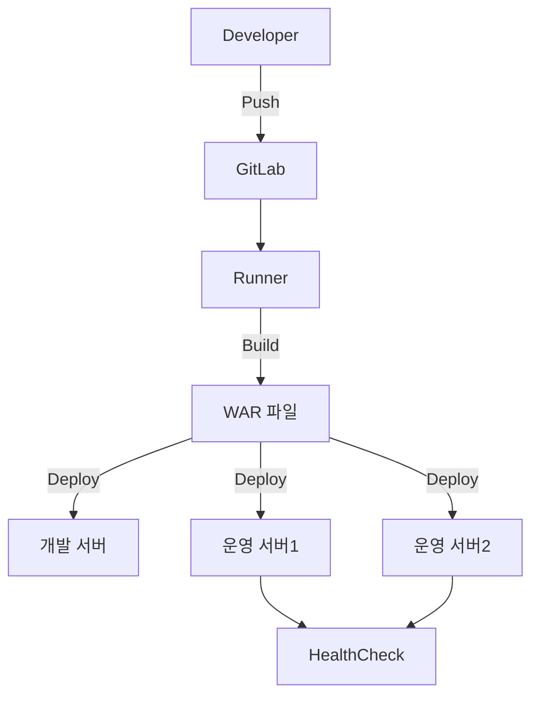

# GitLab CE 구축 및 CI/CD 배포 자동화 (실운영 기준)

## 1. 아키텍처 다이어그램



---

## 2. 배포 흐름 (CI/CD Pipeline)

```mermaid
flowchart LR
    A[Code Push] --> B[GitLab CI Trigger]
    B --> C[Build (Ant)]
    C --> D[Artifact 생성]
    D --> E[개발 서버 배포]
    E --> F[운영 서버 순차 배포]
    F --> G[Health Check]
    G -->|성공| H[완료]
    G -->|실패| I[배포 중단]
```

---

## 3. 핵심 구조 설명

- GitLab: 코드 저장소 + CI/CD 관리
- Runner: 빌드 및 배포 수행
- Artifact: 빌드 결과물 (WAR)
- Deploy: SSH 기반 배포
- Health Check: 서비스 정상 여부 검증

---

## 4. 설계 핵심

- Runner 분리 → 안정성 확보
- Rolling 배포 → 장애 최소화
- Health Check → 실제 서비스 기준 검증
- 백업 전략 → 빠른 롤백

---

## 5. 결론

이 구조는 단순 자동화를 넘어:

- 장애 대응 가능한 배포 구조
- 운영 친화적인 설계
- 확장 가능한 CI/CD 기반

을 목표로 설계되었다.
